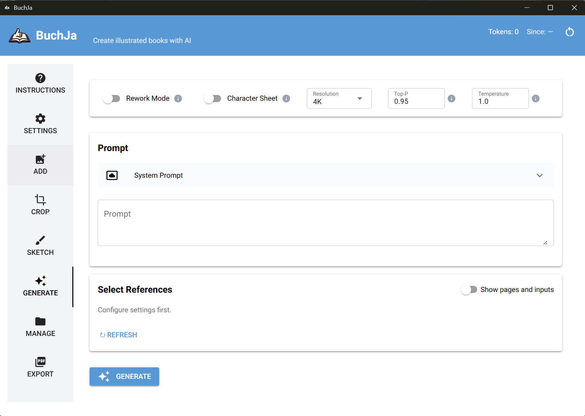

# BuchJa

BuchJa is a locally hosted, browser-based application for creating illustrated books. It uses Google's Gemini API to generate images from your prompts and sketches.

## What can BuchJa do?

*   **Generate Images**: Create illustrations from text prompts or reference images using Gemini.
*   **Sketching**: Draw rough sketches to guide the composition of the generated images.
*   **Manage**: Keep track of your generated images in the app, classifying them as references, pages or input material.
*   **Crop**: Crop images to specific aspect ratios or to extract elements as new references for consistency in coming pages.
*   **Export**: All images saved to disk. Export as PDF for easy sharing.

## Can I use this for commercial projects?

The main purpose of this app is to spread joy, eg to create personalized children's books for friends and family. However, the BuchJa application is MIT licensed, so there is nothing stopping you from using it commercially. But please note, that the images are generated using Google's Gemini API. Please refer to Google's Terms of Service and AI Principles for information on commercial use of generated content. Also consider the implications for artists and illustrators whose work may have been used to train the underlying models.

## Why isn't this running in the cloud?

BuchJa runs as a local server on your machine and opens in your default web browser. This gives you the best of both worlds:
*   **Privacy**: Your data and API keys stay on your machine.
*   **Reliability**: Uses your modern browser for the best UI experience.
*   **Control**: Full access to your local file system for saving images.

## Does this run on my system?

Currently we only support Windows 11. Mac and Linux support is planned for a future release.

## How can I use BuchJa?

### Prerequisites

This is a _bring-your-own-key_ app. You need a Google Gemini API Key to run the image generation. You can get a key through the [Google AI Studio](https://aistudio.google.com/app/apikey).

> **WARNING & DISCLAIMER:** Usage of this application involves calls to Google's Gemini API, which may incur significant costs. You are solely responsible for monitoring and paying for your API usage. The token counter provided in the application is an estimate only and should not be relied upon for billing purposes. Always verify actual usage and costs via the Google Cloud Console or AI Studio. The authors of this software accept no liability for any costs, damages, or data loss incurred. By using this tool, you acknowledge that your data is processed by Google's services and is subject to their Terms of Service and Privacy Policy.

### Installation

1.  Download the latest `BuchJa-vX.X.X.zip` from the [Releases](https://github.com/stephprobst/BuchJa/releases) page.
2.  Unzip it.
3.  Run `BuchJa.exe`.
4.  A console window will open (don't close it!) and your default web browser will open the BuchJa app.

> **Note for Windows Users:** You might get a warning when running the executable for the first time. This is normal for unsigned applications on Windows. The application is new and not widely used yet, so Windows Defender flags it as "Unknown". I'm currently looking into setting up a code signing certificate for future releases.

### Getting started

1.  Open the app and go to the **Settings** tab.
2.  Paste your API Key.
3.  Set a style and aspect ratio for your book.
4.  Add reference pictures to the app.
5.  Start generating character sheets and book pages!

There are more detailed instructions in the **Instructions** tab in the app. A tutorial video is planned.

## I need additional features!

Please open an issue on GitHub describing the feature you would like to see. I cannot promise to implement every request, but I will consider them carefully. Thank you for your feedback and interest in BuchJa!

## Do you support other Models than Gemini?

Not at the moment. Gemini is currently the only model supported. Support for additional models may be added in future releases.

## License

MIT License. See [LICENSE](LICENSE).

*   **Third-Party Licenses**: See `THIRD-PARTY-LICENSES.txt` in the download.
*   **Security**: See [SECURITY.md](SECURITY.md).

## Contributing

Check out [CONTRIBUTING.md](CONTRIBUTING.md) if you want to build it from source or contribute.
